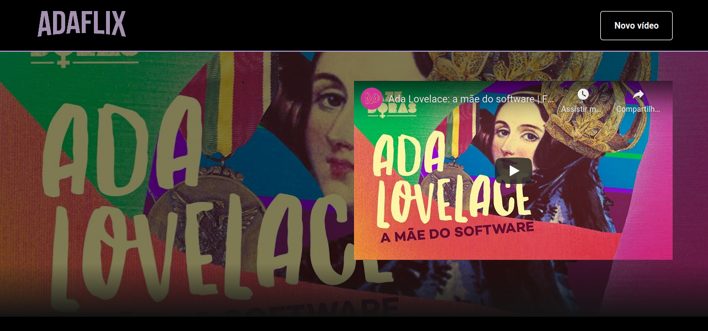

<div align="center">
  <a href="https://www.typescriptlang.org/">
    
  </a>
  <a href="https://reactjs.org/">
    
  </a>
</div>

<div align="center">
  <div>
    <a href="#tecnologias">Tecnologias</a>
    &nbsp;&nbsp;&nbsp;|&nbsp;&nbsp;&nbsp;
    <a href="#uso"> Instalação e Uso</a>
    &nbsp;&nbsp;&nbsp;|&nbsp;&nbsp;&nbsp;
    <a href="#creditos">Créditos</a>
  </div>
  <br/>
  <div>
    <h3>Ada Lovelace estaria orgulhosa de tantas mulheres programadoras talentosas que existem hoje no mundo. Inspire-se. #CodeLikeAGirl</h3>
    
  </div>
</div>

<h2 id="tecnologias">:computer: &nbsp; Tecnologias</h2>

+ [React](https://reactjs.org/)
+ [Styled-components](https://styled-components.com/)
+ [JSON Server](https://github.com/typicode/json-server)


<h2 id="uso">:keyboard: &nbsp; Instalação e Uso</h2>

+ Instale as dependências:
```
$ npm install
```

+ Inicie a aplicação:
```
$ npm run dev
```

A aplicação estará disponível em [localhost:3000](localhost:3000/) e a API estará disponível em [localhost:8080](ocalhost:8080/).

<h2 id="creditos">:link:  &nbsp; Créditos</h2>

Este projeto foi produzido a partir das aulas da #ImersãoReact da Alura.